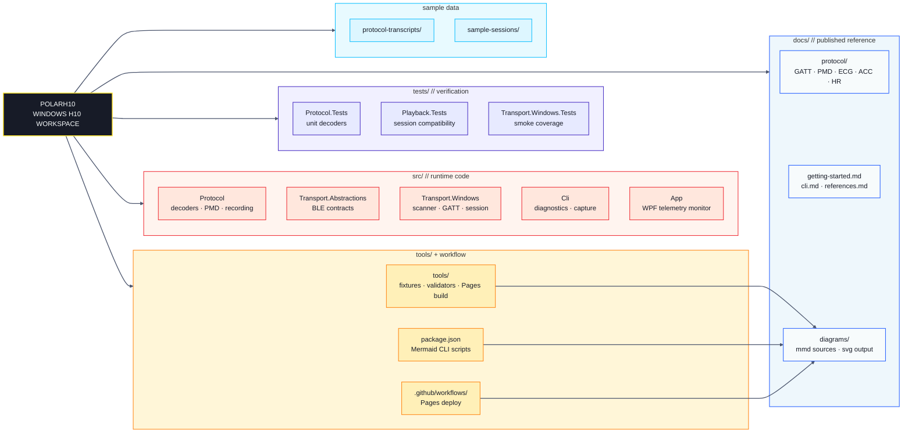
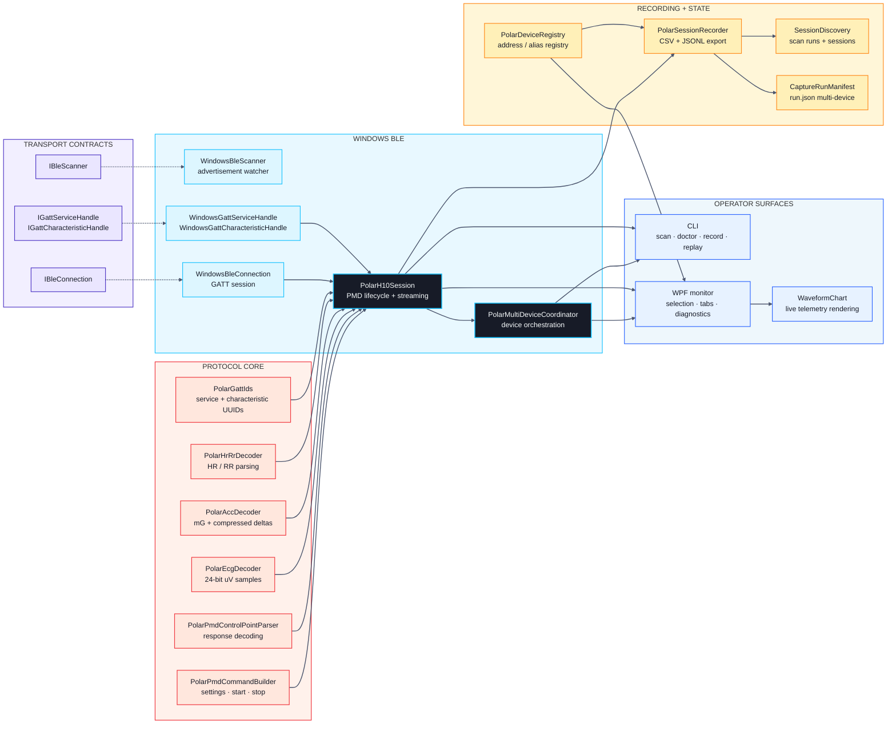
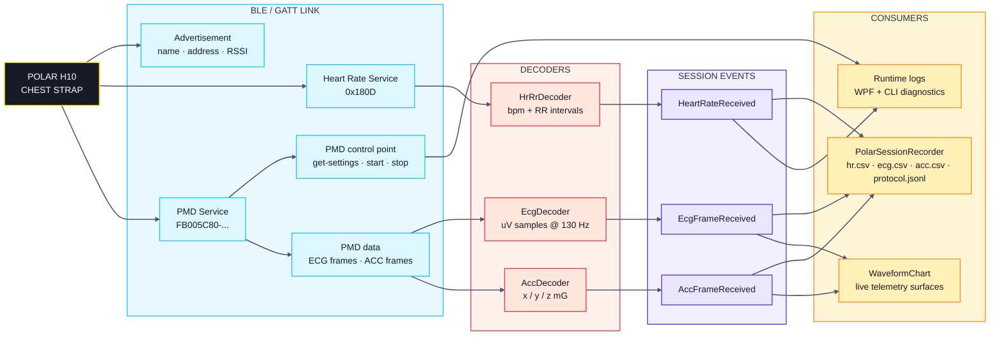

# PolarH10

> **Unofficial** Polar H10 reference connector for .NET.
> Not affiliated with or endorsed by Polar Electro.

A protocol-first .NET 8 library and toolset for direct BLE/GATT communication with the
[Polar H10](https://www.polar.com/en/sensors/h10-heart-rate-sensor) chest strap on
Windows. Streams ECG, accelerometer, and heart rate data without the Polar SDK.

## Features

- **Protocol layer** - pure C# decoders for ECG (24-bit uV), accelerometer (mG with
  compressed deltas), and standard BLE heart rate / RR intervals
- **PMD command builder** - construct get-settings, start, and stop commands for the
  Polar Measurement Data service
- **Windows BLE transport** - WinRT-based scanner, connection, GATT service/characteristic
  handles with notification support
- **CLI** - scan, monitor, record, stream, doctor, replay, and protocol reference commands
- **WPF reference app** - live dashboard with connect, record, and diagnostics tabs
- **Session recorder** - save HR/RR, ECG, and ACC data to CSV with JSONL protocol
  transcripts

## Project Structure

<!-- MERMAID:BEGIN repo-structure -->



<!-- MERMAID:END repo-structure -->

## Architecture

<!-- MERMAID:BEGIN code-architecture -->



<!-- MERMAID:END code-architecture -->

## Data Flow

<!-- MERMAID:BEGIN data-flow -->



<!-- MERMAID:END data-flow -->

## Prerequisites

- Windows 10 version 1903 or later
- .NET 8.0 SDK
- Bluetooth LE adapter
- Polar H10 chest strap (firmware 3.x+)

## Build

```powershell
dotnet build PolarH10.sln
```

## Test

```powershell
dotnet test PolarH10.sln
```

## Quick Start - CLI

```powershell
# Scan for nearby Polar devices
dotnet run --project src/PolarH10.Cli -- scan

# Monitor live data
dotnet run --project src/PolarH10.Cli -- monitor --device <ADDRESS>

# Record a 60-second session
dotnet run --project src/PolarH10.Cli -- record --device <ADDRESS> --duration 60

# Verify connectivity
dotnet run --project src/PolarH10.Cli -- doctor --device <ADDRESS>
```

## Quick Start - WPF App

```powershell
dotnet run --project src/PolarH10.App
```

Enter a device address (or scan to find one), click **Connect**, and start recording.

## Documentation

See the [docs/](docs/) folder:

- [Getting Started](docs/getting-started.md)
- [CLI Reference](docs/cli.md)
- [Protocol Overview](docs/protocol/overview.md)
- [GATT Map](docs/protocol/gatt-map.md)
- [PMD Commands](docs/protocol/pmd-commands.md)
- [ECG Format](docs/protocol/ecg-format.md)
- [ACC Format](docs/protocol/acc-format.md)
- [HR Measurement](docs/protocol/hr-measurement.md)
- [Platform Guides](docs/platform-guides/index.md)
- [References](docs/references.md)
- [Diagrams](docs/diagrams/) - interactive Mermaid viewer and SVG renders

## Diagram Toolchain

The repo includes a Mermaid-based diagram pipeline. Diagrams live as `.mmd`
source files in `docs/diagrams/` and are registered in
`docs/diagrams/manifest.json`. Pre-rendered SVGs are generated by the Mermaid
CLI; the browser-based viewer (`docs/diagrams/viewer.html`) can also live-render
from source.

```powershell
npm install                   # first time - installs mmdc, browser-sync, etc.
npm run diagram:render:all    # render all .mmd -> .svg
npm run diagram:sync:readme   # inject .mmd content into README marker blocks
npm run diagram:dev           # watch + live browser preview
```

## GitHub Pages

The repository now includes a GitHub Pages workflow that:

- renders all Mermaid diagrams to SVG
- builds a static site from the Markdown docs
- deploys the generated `site/` artifact via GitHub Actions

```powershell
npm run pages:build           # build the full Pages site into ./site
npm run pages:serve           # preview the generated site locally
npm run pages:dev             # watch docs + diagrams and auto-rebuild the site
```

## References

- [Polar BLE SDK](https://github.com/polarofficial/polar-ble-sdk) (MIT License) -
  technical documentation at
  [tag 4.0.0](https://github.com/polarofficial/polar-ble-sdk/tree/4.0.0/technical_documentation/)
- Siecinski, S. et al., "The Newer, the More Secure? Comparing the Polar Verity Sense
  and H10 Heart Rate Sensors," *Sensors*, vol. 25, no. 7, 2025.
  [DOI: 10.3390/s25072005](https://doi.org/10.3390/s25072005)

## License

[MIT](LICENSE)

## Disclaimer

This project communicates directly with the Polar H10 via standard Bluetooth Low Energy.
It is not affiliated with, endorsed by, or certified by Polar Electro Oy. Use at your
own risk. Always consult a medical professional before using ECG data for health
decisions.
