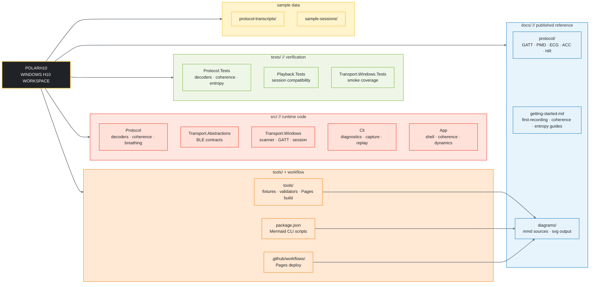
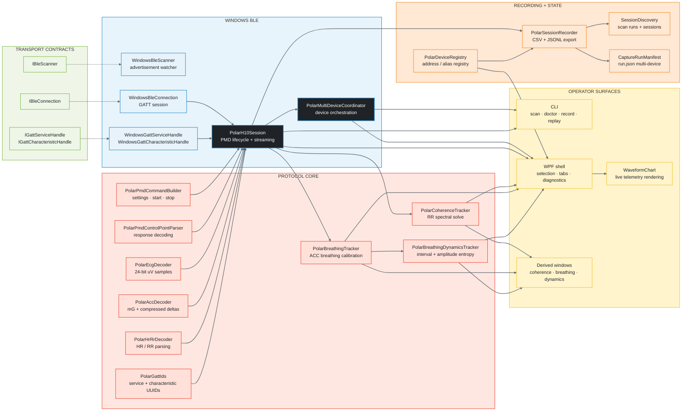
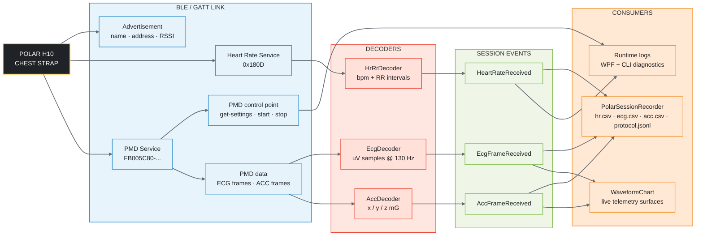

# PolarH10

> **Unofficial** Windows-first Polar H10 toolkit for .NET.
> Not affiliated with or endorsed by Polar Electro.

Use a Polar H10 on Windows without the Polar SDK. Scan nearby straps, inspect
live HR, ECG, and ACC data, review RR-derived coherence and breathing-dynamics
entropy, compare multiple active straps, and record reusable sessions from a
WPF app or CLI.

## What It Gives You

- **WPF operator surface** for scan, connect, live telemetry, RR-derived coherence review, breathing calibration, breathing-dynamics entropy review, diagnostics, and recording
- **CLI capture path** for `scan`, `monitor`, `doctor`, `record`, `replay`, `sessions`, and protocol output
- **Protocol layer** with C# decoders for ECG, accelerometer, and heart rate / RR intervals
- **Windows BLE transport** with WinRT scanner, connection, and GATT support
- **Session recorder** that writes CSV sensor data plus JSON metadata and JSONL protocol transcripts
- **GitHub Pages docs** with onboarding guides, troubleshooting, output-file notes, and Mermaid diagrams

## What This Project Is

- A Windows-first direct BLE/GATT workflow for the [Polar H10](https://www.polar.com/en/sensors/h10-heart-rate-sensor).
- A practical operator tool as well as a protocol reference.
- A source-available way to inspect and record telemetry without taking a dependency on the Polar SDK at runtime.

## What This Project Is Not

- It is not an official Polar SDK.
- It is not endorsed by or affiliated with Polar Electro Oy.
- It is not a medical device or a substitute for clinical interpretation.

## Quick Start

### Prerequisites

- Windows 10 version 1903 or later
- .NET 8.0 SDK
- Bluetooth LE adapter
- Polar H10 chest strap (firmware 3.x+)

### Clone, build, and test

```powershell
git clone https://github.com/MesmerPrism/PolarH10.git
cd PolarH10
dotnet build PolarH10.sln
dotnet test PolarH10.sln
```

## Choose Your Path

### Use the WPF app

```powershell
dotnet run --project src/PolarH10.App
```

Use the app when you want the fastest operator workflow: scan nearby straps,
connect, inspect live telemetry, review RR-derived coherence, calibrate
breathing, review breathing-dynamics entropy, compare multiple straps, and
record sessions from the desktop surface.

The coherence workflow follows the fixed spectral method described in McCraty et
al., *The Coherent Heart* (2006), while also preserving the normalized
AstralKarateDojo-compatible score used for the app's headline and chart surfaces.

Read next:

- [App Overview](docs/app-overview.md)
- [Getting Started on Windows](docs/getting-started.md)
- [First Recording](docs/first-recording.md)
- [Coherence Workflow](docs/coherence-workflow.md)
- [Breathing Workflow](docs/breathing-workflow.md)
- [Breathing Dynamics Workflow](docs/breathing-dynamics-workflow.md)

If Windows application-control policy blocks the normal multi-file app launch on
this machine, publish a single-file build:

```powershell
dotnet publish src/PolarH10.App/PolarH10.App.csproj `
  -c Release `
  -r win-x64 `
  -p:PublishSingleFile=true `
  -p:SelfContained=false `
  -o out/app-single
```

### Use the CLI

```powershell
# Scan for nearby Polar devices
dotnet run --project src/PolarH10.Cli -- scan

# Verify connectivity
dotnet run --project src/PolarH10.Cli -- doctor --device <ADDRESS>

# Record a 60-second session
dotnet run --project src/PolarH10.Cli -- record --device <ADDRESS> --duration 60 --out .\session\first-run
```

Use the CLI when you want a scriptable path, a smaller surface area, or replay
without the WPF app.

Read next:

- [CLI Reference](docs/cli.md)
- [First Recording](docs/first-recording.md)
- [Output Formats](docs/output-formats.md)
- [Troubleshooting](docs/troubleshooting.md)

### Study the protocol or integrate the library

Start here if you already know the operator flow and now need the service map,
control-point commands, frame layouts, or code architecture.

- [Protocol Overview](docs/protocol/overview.md)
- [GATT Map](docs/protocol/gatt-map.md)
- [PMD Commands](docs/protocol/pmd-commands.md)
- [ECG Format](docs/protocol/ecg-format.md)
- [ACC Format](docs/protocol/acc-format.md)
- [HR Measurement](docs/protocol/hr-measurement.md)
- [Diagram Viewer](docs/diagrams/)

## First Session Checklist

1. Scan for the intended strap and note the Bluetooth address.
2. Connect once and confirm HR plus ACC are actually moving.
3. Inspect live ECG / ACC / RR in the app or CLI before committing to a long capture.
4. If you need derived metrics, open the coherence or breathing-dynamics windows only after the relevant warmup conditions are met.
5. Record a short session and verify `session.json`, CSV sensor files, and `protocol.jsonl`.
6. Replay or inspect the saved session without hardware attached.

## Documentation

- [Docs Home](docs/index.md)
- [Getting Started](docs/getting-started.md)
- [App Overview](docs/app-overview.md)
- [CLI Reference](docs/cli.md)
- [First Recording](docs/first-recording.md)
- [Coherence Workflow](docs/coherence-workflow.md)
- [Breathing Workflow](docs/breathing-workflow.md)
- [Breathing Dynamics Workflow](docs/breathing-dynamics-workflow.md)
- [Output Formats](docs/output-formats.md)
- [Troubleshooting](docs/troubleshooting.md)
- [FAQ](docs/faq.md)
- [Platform Guides](docs/platform-guides/index.md)
- [Protocol Overview](docs/protocol/overview.md)
- [References](docs/references.md)
- [Diagrams](docs/diagrams/)

## GitHub Pages

The repository includes a custom GitHub Pages workflow that:

- renders Mermaid diagrams to SVG
- builds a static site from the Markdown docs
- validates links and diagram assets before deployment
- adds static search indexing for the generated site
- deploys the generated `site/` artifact via GitHub Actions

```powershell
npm install
npm run pages:build
npm run pages:serve
npm run pages:dev
```

## Diagram Toolchain

The Mermaid-based diagram pipeline keeps larger operational diagrams in
`docs/diagrams/` and the generated site, while the README only carries the core
architecture maps.

```powershell
npm install
npm run diagram:render:all
npm run diagram:sync:readme
npm run diagram:dev
```

## Project Structure

<!-- MERMAID:BEGIN repo-structure -->



<!-- MERMAID:END repo-structure -->

## Architecture

<!-- MERMAID:BEGIN code-architecture -->



<!-- MERMAID:END code-architecture -->

## Data Flow

<!-- MERMAID:BEGIN data-flow -->



<!-- MERMAID:END data-flow -->

## References

- [Polar BLE SDK](https://github.com/polarofficial/polar-ble-sdk) (MIT License) -
  technical documentation at
  [tag 4.0.0](https://github.com/polarofficial/polar-ble-sdk/tree/4.0.0/technical_documentation/)
- Siecinski, S. et al., "The Newer, the More Secure? Comparing the Polar Verity Sense
  and H10 Heart Rate Sensors," *Sensors*, vol. 25, no. 7, 2025.
  [DOI: 10.3390/s25072005](https://doi.org/10.3390/s25072005)
- McCraty, R., Atkinson, M., Tomasino, D., and Bradley, R.T., *The Coherent Heart:
  Heart-Brain Interactions, Psychophysiological Coherence, and the Emergence of
  System-Wide Order*, Institute of HeartMath, 2006.
- Goheen, D. P. et al., "It's About Time: Breathing Dynamics Modulate Emotion and
  Cognition," *Psychophysiology*, 2025.
  [DOI: 10.1111/psyp.70149](https://doi.org/10.1111/psyp.70149)
- [CANALLAB/breathing_wm](https://github.com/CANALLAB/breathing_wm) - companion
  code repository linked by the breathing-dynamics paper
- NeuroKit2 implementation pages used as breathing-dynamics method provenance:
  [sample entropy](https://neuropsychology.github.io/NeuroKit/_modules/neurokit2/complexity/entropy_sample.html),
  [multiscale entropy](https://neuropsychology.github.io/NeuroKit/_modules/neurokit2/complexity/entropy_multiscale.html),
  [PSD slope](https://neuropsychology.github.io/NeuroKit/_modules/neurokit2/complexity/fractal_psdslope.html),
  [autocorrelation](https://neuropsychology.github.io/NeuroKit/_modules/neurokit2/signal/signal_autocor.html),
  [Lempel-Ziv complexity](https://neuropsychology.github.io/NeuroKit/_modules/neurokit2/complexity/complexity_lempelziv.html)

## License

[MIT](LICENSE)

## Disclaimer

This project communicates directly with the Polar H10 via standard Bluetooth Low
Energy. It is not affiliated with, endorsed by, or certified by Polar Electro
Oy. Use at your own risk. Always consult a medical professional before using ECG
data for health decisions.
