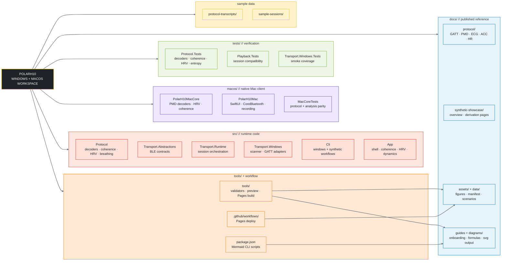
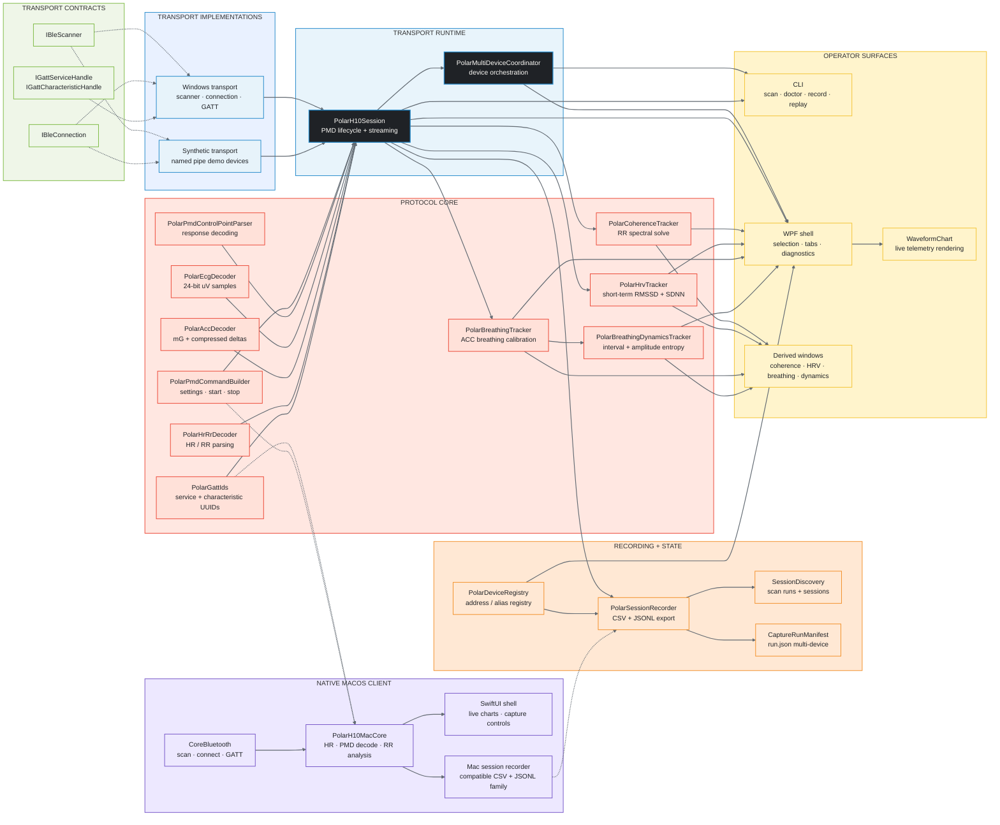
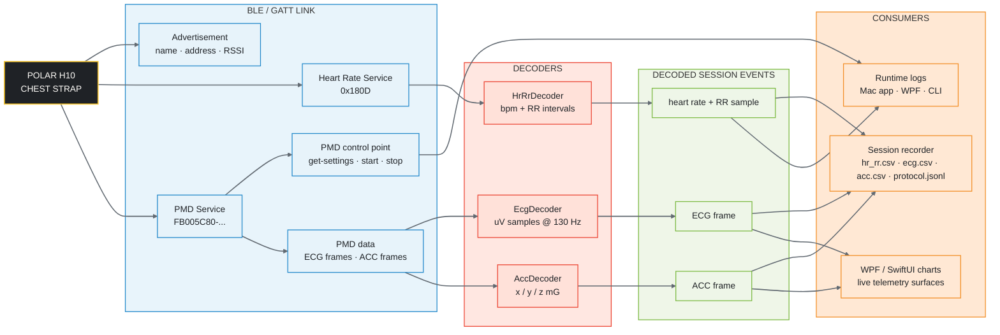

# PolarH10

> **Unofficial** Windows and macOS Polar H10 telemetry toolkit.
> Not affiliated with or endorsed by Polar Electro.

Capture, inspect, and record Polar H10 telemetry without the Polar SDK. Use the
native SwiftUI app on macOS, the fuller WPF operator surface on Windows, or the
Windows CLI for scan, doctor, record, replay, and protocol inspection.

Start with [Docs Home](docs/index.md) or the live
[Pages site](https://mesmerprism.github.io/PolarH10/).
If a public research preview release exists, install it from
[Download & Install](https://mesmerprism.github.io/PolarH10/reference/download.html).
The current release channel includes a Universal Mac app plus the self-signed
Windows Research Preview installer.

## What It Gives You

- **WPF operator surface** for scan, connect, live telemetry, RR-derived coherence review, short-term HRV review, breathing calibration, breathing-dynamics entropy review, diagnostics, and recording
- **Native Mac operator surface** for CoreBluetooth scan/connect, live HR/RR/ECG/ACC, rolling HRV and coherence, and compatible session capture
- **CLI capture path** for `scan`, `monitor`, `doctor`, `record`, `replay`, `sessions`, and protocol output
- **Protocol layer** with C# decoders for ECG, accelerometer, and heart rate / RR intervals
- **Windows BLE transport** with WinRT scanner, connection, and GATT support
- **macOS BLE transport** through Apple's CoreBluetooth framework
- **Session recorder** that writes CSV sensor data plus JSON metadata and JSONL protocol transcripts
- **GitHub Pages docs** with onboarding guides, troubleshooting, output-file notes, and Mermaid diagrams
- **Synthetic showcase publication bundle** with committed figures, manifest metadata, and scenario exports for reproducible examples

## What This Project Is

- A direct BLE/GATT workflow for the [Polar H10](https://www.polar.com/en/sensors/h10-heart-rate-sensor) on Windows and macOS.
- A practical operator tool as well as a protocol reference.
- A source-available way to inspect and record telemetry without taking a dependency on the Polar SDK at runtime.

## What This Project Is Not

- It is not an official Polar SDK.
- It is not endorsed by or affiliated with Polar Electro Oy.
- It is not a medical device or a substitute for clinical interpretation.

## Quick Start

### Platform prerequisites

- Bluetooth LE adapter
- Polar H10 chest strap (firmware 3.x+)
- macOS 13 or later for the native Mac app
- Windows 10 version 1903 or later and the .NET 8.0 SDK for Windows source builds

### Install the packaged app

Use the published [Download & Install](https://mesmerprism.github.io/PolarH10/reference/download.html)
page for the Universal Mac ZIP or guided Windows installer.

### Clone, build, and test

```powershell
git clone https://github.com/MesmerPrism/PolarH10.git
cd PolarH10
dotnet build PolarH10.sln
dotnet test PolarH10.sln
```

## Choose Your Path

### Use the macOS app

Download `PolarH10-macOS-universal.zip` from the
[latest release](https://github.com/GeorgeFejer91/PolarH10/releases/latest), or
run the Swift package from source on a Mac:

```bash
swift test --package-path macos
bash tools/macos/build-app.sh 0.1.0
open artifacts/macos/PolarH10.app
```

The native Mac preview scans and connects through CoreBluetooth, streams HR,
RR, ECG, and ACC, computes rolling HRV/coherence metrics, and saves the same
session file family used elsewhere in the repo. See [Getting Started on
macOS](docs/platform-guides/macos.md) for installation, permissions, current
feature scope, and Universal app packaging.

### Use the WPF app

```powershell
dotnet run --project src/PolarH10.App
```

Use the app when you want the fastest operator workflow: scan nearby straps,
connect, inspect live telemetry, review RR-derived coherence and short-term
HRV, calibrate breathing, review breathing-dynamics entropy, compare multiple
straps, and record sessions from the desktop surface.

The coherence workflow follows the fixed spectral method described in McCraty et
al., *The Coherent Heart* (2006), while also surfacing a normalized
operator-facing score on the app's headline and chart surfaces.

The HRV workflow follows the short-term time-domain guidance summarized by
Shaffer and Ginsberg, *An Overview of Heart Rate Variability Metrics and Norms*
(2017), using RMSSD as the headline value from a rolling accepted RR window.

In a real H10 session, that RR stream comes from the strap's own beat timing,
which is device-derived from ECG. The ACC breathing-volume tracker is
repository-specific and should be treated as an operator aid rather than an
externally validated method.

Read next:

- [App Overview](docs/app-overview.md)
- [Getting Started on Windows](docs/getting-started.md)
- [First Recording](docs/first-recording.md)
- [Coherence Workflow](docs/coherence-workflow.md)
- [HRV Workflow](docs/hrv-workflow.md)
- [Breathing Workflow](docs/breathing-workflow.md)
- [Breathing Dynamics Workflow](docs/breathing-dynamics-workflow.md)
- [Formula Sheets](docs/formula-sheets.md)
- [Synthetic Showcase](docs/synthetic-showcase/index.md)

If you want a stable repo-local desktop build instead of `dotnet run`, build it
into `out/workspace-app`:

```powershell
powershell -ExecutionPolicy Bypass -File .\tools\app\Build-Workspace-App.ps1
.\out\workspace-app\PolarH10.App.exe
```

If Windows application-control policy blocks that normal multi-file workspace
build on this machine, publish a single-file fallback instead:

```powershell
dotnet publish src/PolarH10.App/PolarH10.App.csproj `
  -c Release `
  -r win-x64 `
  -p:PublishSingleFile=true `
  -p:SelfContained=false `
  -o out/app-single
```

### Use the CLI

```powershell
# Scan for nearby Polar devices
dotnet run --project src/PolarH10.Cli -- scan

# Verify connectivity
dotnet run --project src/PolarH10.Cli -- doctor --device <ADDRESS>

# Record a 60-second session
dotnet run --project src/PolarH10.Cli -- record --device <ADDRESS> --duration 60 --out .\session\first-run
```

Use the CLI when you want a scriptable path, a smaller surface area, or replay
without the WPF app.

Read next:

- [CLI Reference](docs/cli.md)
- [First Recording](docs/first-recording.md)
- [Output Formats](docs/output-formats.md)
- [Troubleshooting](docs/troubleshooting.md)

### Study the protocol or integrate the library

Start here if you already know the operator flow and now need the service map,
control-point commands, frame layouts, or code architecture.

- [Protocol Overview](docs/protocol/overview.md)
- [GATT Map](docs/protocol/gatt-map.md)
- [PMD Commands](docs/protocol/pmd-commands.md)
- [ECG Format](docs/protocol/ecg-format.md)
- [ACC Format](docs/protocol/acc-format.md)
- [HR Measurement](docs/protocol/hr-measurement.md)
- [Diagram Viewer](docs/diagrams/)

## First Session Checklist

1. Scan for the intended strap and note the Bluetooth address.
2. Connect once and confirm HR plus ACC are actually moving.
3. Inspect live ECG / ACC / RR in the app or CLI before committing to a long capture.
4. If you need derived metrics, open the coherence, HRV, or breathing-dynamics tabs only after the relevant warmup conditions are met.
5. Record a short session and verify `session.json`, CSV sensor files, and `protocol.jsonl`.
6. Replay or inspect the saved session without hardware attached.

## Documentation

- [Docs Home](docs/index.md)
- [Getting Started](docs/getting-started.md)
- [App Overview](docs/app-overview.md)
- [CLI Reference](docs/cli.md)
- [First Recording](docs/first-recording.md)
- [Coherence Workflow](docs/coherence-workflow.md)
- [HRV Workflow](docs/hrv-workflow.md)
- [Breathing Workflow](docs/breathing-workflow.md)
- [Breathing Dynamics Workflow](docs/breathing-dynamics-workflow.md)
- [Formula Sheets](docs/formula-sheets.md)
- [Output Formats](docs/output-formats.md)
- [Troubleshooting](docs/troubleshooting.md)
- [FAQ](docs/faq.md)
- [Platform Guides](docs/platform-guides/index.md)
- [Synthetic Showcase](docs/synthetic-showcase/index.md)
- [Protocol Overview](docs/protocol/overview.md)
- [References](docs/references.md)
- [Diagrams](docs/diagrams/)

## Synthetic Showcase Publication Bundle

The sibling `SyntheticBio` repo is the deterministic generator for the
synthetic showcase published by this repo. The committed publication bundle
lives under `docs/data/synthetic-showcase/` and
`docs/assets/synthetic-showcase/`, and the Pages build copies both trees
directly so the public site does not depend on a sibling checkout.

Start with [Synthetic Showcase](docs/synthetic-showcase/index.md) when you need
example raw inputs, intermediate `analysis.json` traces, or downloadable
SVG/PNG/PDF figures for supplementary material and methods explanation.
## Feedback and contributions

PolarH10 is shaped by real device sessions, Windows BLE edge cases, and actual
onboarding friction. Feedback is useful even if you are not sending code.

Open an issue if you hit setup friction, device compatibility quirks, confusing
docs, protocol questions, or unexpected data behavior. Repro steps, adapter
details, logs, and small doc fixes are especially useful.

- [Open an issue](https://github.com/MesmerPrism/PolarH10/issues)
- [Read the contributing guide](CONTRIBUTING.md)

## GitHub Pages

The repository includes a custom GitHub Pages workflow that:

- renders Mermaid diagrams to SVG
- builds a static site from the Markdown docs
- copies committed showcase data and figure assets from `docs/data/` and `docs/assets/`
- validates links and diagram assets before deployment
- adds static search indexing for the generated site
- deploys the generated `site/` artifact via GitHub Actions

```powershell
npm install
npm run formula-sheets:pdf
npm run pages:build
npm run pages:serve
npm run pages:dev
```

## Windows installer pipeline

The public Windows installer flow is driven by the MSIX packaging project under
`src/PolarH10.App.Package` and the release workflow in
`.github/workflows/release-windows.yml`.

The no-budget path is a **Research Preview** channel signed by a stable self-signed
certificate that you generate once and keep in GitHub Actions secrets.

Generate that certificate locally with:

```powershell
powershell -ExecutionPolicy Bypass -File .\tools\app\New-Preview-SigningCertificate.ps1
```

That writes a `.pfx`, a public `PolarH10.cer`, and a Base64 text file under
`artifacts\preview-signing\`.

Then configure these repository secrets:

- `WINDOWS_PACKAGE_CERTIFICATE_BASE64`
- `WINDOWS_PACKAGE_CERTIFICATE_PASSWORD`
- `WINDOWS_PACKAGE_PUBLISHER`

Optional repository variable:

- `WINDOWS_PACKAGE_TIMESTAMP_URL`

Then create and push a tag like `v0.1.0`. The release workflow builds and tests
the solution, packages the WPF app as `PolarH10.msix`, generates
`PolarH10.appinstaller`, publishes the guided `PolarH10-Preview-Setup.exe`
bootstrapper, exports `PolarH10.cer`, writes `SHA256SUMS.txt`, and uploads
them to the GitHub release.

The guided setup helper imports `PolarH10.cer` into `Local Machine > Trusted
People` and then opens App Installer automatically. The fully manual fallback
is still available if users prefer to trust the cert themselves first.

For a local unsigned packaging check, run:

```powershell
powershell -ExecutionPolicy Bypass -File .\tools\app\Build-App-Package.ps1 -Unsigned
```

## macOS app pipeline

The native Mac source lives under `macos/`. The release workflow in
`.github/workflows/release-macos.yml` tests the portable decoder/analysis core,
builds the SwiftUI/CoreBluetooth app for both `arm64` and `x86_64`, combines the
binaries into `PolarH10.app`, and publishes
`PolarH10-macOS-universal.zip` plus its SHA-256 checksum.

Build the same Universal artifact locally on a Mac with Xcode 15 or later:

```bash
bash tools/macos/build-app.sh 0.1.0
open artifacts/macos/PolarH10.app
```

The public no-budget Mac channel is ad-hoc signed rather than notarized, so the
first launch requires Control-click > Open or approval in Privacy & Security.

## Diagram Toolchain

The Mermaid-based diagram pipeline keeps larger operational diagrams in
`docs/diagrams/` and the generated site, while the README only carries the core
architecture maps.

```powershell
npm install
npm run diagram:render:all
npm run diagram:sync:readme
npm run diagram:dev
```

## Project Structure

<!-- MERMAID:BEGIN repo-structure -->


```mermaid
flowchart LR
    R["POLARH10<br/>WINDOWS + MACOS WORKSPACE"]

    subgraph Source["src/ // runtime code"]
        P1["Protocol<br/>decoders · coherence · HRV · breathing"]
        P2["Transport.Abstractions<br/>BLE contracts"]
        P3["Transport.Runtime<br/>session orchestration"]
        P4["Transport.Windows<br/>scanner · GATT adapters"]
        P5["Cli<br/>windows + synthetic workflows"]
        P6["App<br/>shell · coherence · HRV · dynamics"]
    end

    subgraph Mac["macos/ // native Mac client"]
        M1["PolarH10MacCore<br/>PMD decoders · HRV · coherence"]
        M2["PolarH10Mac<br/>SwiftUI · CoreBluetooth · recording"]
        M3["MacCoreTests<br/>protocol + analysis parity"]
    end

    subgraph Tests["tests/ // verification"]
        T1["Protocol.Tests<br/>decoders · coherence · HRV · entropy"]
        T2["Playback.Tests<br/>session compatibility"]
        T3["Transport.Windows.Tests<br/>smoke coverage"]
    end

    subgraph Docs["docs/ // published reference"]
        D1["protocol/<br/>GATT · PMD · ECG · ACC · HR"]
        D2["synthetic-showcase/<br/>overview · derivation pages"]
        D3["assets/ + data/<br/>figures · manifest · scenarios"]
        D4["guides + diagrams/<br/>onboarding · formulas · svg output"]
    end

    subgraph Tooling["tools/ + workflow"]
        TL1["tools/<br/>validators · preview · Pages build"]
        TL2["package.json<br/>Mermaid CLI scripts"]
        TL3[".github/workflows/<br/>Pages deploy"]
    end

    subgraph Samples["sample data"]
        S1["protocol-transcripts/"]
        S2["sample-sessions/"]
    end

    R --> Source
    R --> Mac
    R --> Tests
    R --> Docs
    R --> Tooling
    R --> Samples
    TL1 --> D4
    TL1 --> D3
    TL2 --> D4
    TL3 --> D3

    style Source fill:#FFE7E1,stroke:#EC4736,stroke-width:1.5px;
    style Mac fill:#EDE8FF,stroke:#7657C8,stroke-width:1.5px;
    style Tests fill:#EFF6E8,stroke:#7DBA44,stroke-width:1.5px;
    style Docs fill:#E8F4FB,stroke:#258ACB,stroke-width:1.5px;
    style Tooling fill:#FFE8D4,stroke:#F28F28,stroke-width:1.5px;
    style Samples fill:#FFF4CC,stroke:#F3C333,stroke-width:1.5px;

    classDef hub fill:#1F2226,stroke:#F3C333,color:#FFFDF9,stroke-width:2px;
    classDef source fill:#FFE1D9,stroke:#EC4736,color:#1F2226,stroke-width:1.5px;
    classDef tests fill:#EEF6E8,stroke:#7DBA44,color:#1F2226,stroke-width:1.5px;
    classDef docs fill:#E7F3FA,stroke:#258ACB,color:#1F2226,stroke-width:1.5px;
    classDef tooling fill:#FFE8D4,stroke:#F28F28,color:#1F2226,stroke-width:1.5px;
    classDef sample fill:#FFF4CC,stroke:#F3C333,color:#1F2226,stroke-width:1.5px;
    classDef mac fill:#EDE8FF,stroke:#7657C8,color:#1F2226,stroke-width:1.5px;
    class R hub;
    class P1,P2,P3,P4,P5,P6 source;
    class M1,M2,M3 mac;
    class T1,T2,T3 tests;
    class D1,D2,D3,D4 docs;
    class TL1,TL2,TL3 tooling;
    class S1,S2 sample;
    linkStyle default stroke:#626A72,stroke-width:1.8px;
```

<!-- MERMAID:END repo-structure -->

## Architecture

<!-- MERMAID:BEGIN code-architecture -->


```mermaid
flowchart LR
    subgraph Protocol["PROTOCOL CORE"]
        EC["PolarEcgDecoder<br/>24-bit uV samples"]
        AC["PolarAccDecoder<br/>mG + compressed deltas"]
        HR["PolarHrRrDecoder<br/>HR / RR parsing"]
        CH["PolarCoherenceTracker<br/>RR spectral solve"]
        HV["PolarHrvTracker<br/>short-term RMSSD + SDNN"]
        BR["PolarBreathingTracker<br/>ACC breathing calibration"]
        BD["PolarBreathingDynamicsTracker<br/>interval + amplitude entropy"]
        PMD["PolarPmdCommandBuilder<br/>settings · start · stop"]
        CP["PolarPmdControlPointParser<br/>response decoding"]
        GID["PolarGattIds<br/>service + characteristic UUIDs"]
    end

    subgraph Transport["TRANSPORT CONTRACTS"]
        IS["IBleScanner"]
        IC["IBleConnection"]
        IG["IGattServiceHandle<br/>IGattCharacteristicHandle"]
    end

    subgraph Runtime["TRANSPORT RUNTIME"]
        SE["PolarH10Session<br/>PMD lifecycle + streaming"]
        MD["PolarMultiDeviceCoordinator<br/>device orchestration"]
    end

    subgraph Implementations["TRANSPORT IMPLEMENTATIONS"]
        WB["Windows transport<br/>scanner · connection · GATT"]
        SB["Synthetic transport<br/>named pipe demo devices"]
    end

    subgraph Recording["RECORDING + STATE"]
        RE["PolarSessionRecorder<br/>CSV + JSONL export"]
        SD["SessionDiscovery<br/>scan runs + sessions"]
        MA["CaptureRunManifest<br/>run.json multi-device"]
        DR["PolarDeviceRegistry<br/>address / alias registry"]
    end

    subgraph Surfaces["OPERATOR SURFACES"]
        C1["CLI<br/>scan · doctor · record · replay"]
        G1["WPF shell<br/>selection · tabs · diagnostics"]
        G2["Derived windows<br/>coherence · HRV · breathing · dynamics"]
        G3["WaveformChart<br/>live telemetry rendering"]
    end

    subgraph MacClient["NATIVE MACOS CLIENT"]
        MB["CoreBluetooth<br/>scan · connect · GATT"]
        MC["PolarH10MacCore<br/>HR · PMD decode · RR analysis"]
        MG["SwiftUI shell<br/>live charts · capture controls"]
        MR["Mac session recorder<br/>compatible CSV + JSONL family"]
    end

    PMD --> SE
    CP --> SE
    EC --> SE
    AC --> SE
    HR --> SE
    GID --> SE
    IS -.-> WB
    IC -.-> WB
    IG -.-> WB
    IS -.-> SB
    IC -.-> SB
    WB --> SE
    SB --> SE
    SE --> MD
    SE --> CH
    SE --> HV
    SE --> BR
    BR --> BD
    SE --> RE
    RE --> SD
    RE --> MA
    DR --> RE
    DR --> G1
    MD --> C1
    MD --> G1
    SE --> C1
    SE --> G1
    CH --> G1
    CH --> G2
    HV --> G1
    HV --> G2
    BR --> G1
    BR --> G2
    BD --> G1
    BD --> G2
    G1 --> G3
    MB --> MC
    MC --> MG
    MC --> MR
    GID -.-> MC
    PMD -.-> MC
    MR -.-> RE

    style Protocol fill:#FFE7E1,stroke:#EC4736,stroke-width:1.5px;
    style Transport fill:#EFF6E8,stroke:#7DBA44,stroke-width:1.5px;
    style Runtime fill:#E8F4FB,stroke:#258ACB,stroke-width:1.5px;
    style Implementations fill:#E9F1FF,stroke:#258ACB,stroke-width:1.5px;
    style Recording fill:#FFE8D4,stroke:#F28F28,stroke-width:1.5px;
    style Surfaces fill:#FFF4CC,stroke:#F3C333,stroke-width:1.5px;
    style MacClient fill:#EDE8FF,stroke:#7657C8,stroke-width:1.5px;

    classDef core fill:#FFE1D9,stroke:#EC4736,color:#1F2226,stroke-width:1.5px;
    classDef contracts fill:#EEF6E8,stroke:#7DBA44,color:#1F2226,stroke-width:1.5px;
    classDef impl fill:#E7F3FA,stroke:#258ACB,color:#1F2226,stroke-width:1.5px;
    classDef active fill:#1F2226,stroke:#258ACB,color:#FFFDF9,stroke-width:2px;
    classDef record fill:#FFE8D4,stroke:#F28F28,color:#1F2226,stroke-width:1.5px;
    classDef surface fill:#FFF4CC,stroke:#F3C333,color:#1F2226,stroke-width:1.5px;
    classDef mac fill:#EDE8FF,stroke:#7657C8,color:#1F2226,stroke-width:1.5px;
    class EC,AC,HR,CH,HV,BR,BD,PMD,CP,GID core;
    class IS,IC,IG contracts;
    class WB,SB impl;
    class SE,MD active;
    class RE,SD,MA,DR record;
    class C1,G1,G2,G3 surface;
    class MB,MC,MG,MR mac;
    linkStyle default stroke:#626A72,stroke-width:1.8px;
```

<!-- MERMAID:END code-architecture -->

## Data Flow

<!-- MERMAID:BEGIN data-flow -->


```mermaid
flowchart LR
    H10["POLAR H10<br/>CHEST STRAP"]

    subgraph Link["BLE / GATT LINK"]
        ADV["Advertisement<br/>name · address · RSSI"]
        HRS["Heart Rate Service<br/>0x180D"]
        PMD["PMD Service<br/>FB005C80-..."]
        CTRL["PMD control point<br/>get-settings · start · stop"]
        DATA["PMD data<br/>ECG frames · ACC frames"]
    end

    subgraph Decode["DECODERS"]
        DHR["HrRrDecoder<br/>bpm + RR intervals"]
        DECG["EcgDecoder<br/>uV samples @ 130 Hz"]
        DACC["AccDecoder<br/>x / y / z mG"]
    end

    subgraph Session["DECODED SESSION EVENTS"]
        SHR["heart rate + RR sample"]
        SECG["ECG frame"]
        SACC["ACC frame"]
    end

    subgraph Output["CONSUMERS"]
        REC["Session recorder<br/>hr_rr.csv · ecg.csv · acc.csv · protocol.jsonl"]
        CHART["WPF / SwiftUI charts<br/>live telemetry surfaces"]
        LOG["Runtime logs<br/>Mac app · WPF · CLI"]
    end

    H10 --> ADV
    H10 --> HRS
    H10 --> PMD
    PMD --> CTRL
    PMD --> DATA

    HRS --> DHR --> SHR
    DATA --> DECG --> SECG
    DATA --> DACC --> SACC

    SHR --> REC
    SECG --> REC
    SACC --> REC
    SHR --> LOG
    SECG --> CHART
    SACC --> CHART
    CTRL --> LOG

    style Link fill:#E8F4FB,stroke:#258ACB,stroke-width:1.5px;
    style Decode fill:#FFE7E1,stroke:#EC4736,stroke-width:1.5px;
    style Session fill:#EFF6E8,stroke:#7DBA44,stroke-width:1.5px;
    style Output fill:#FFE8D4,stroke:#F28F28,stroke-width:1.5px;

    classDef hardware fill:#1F2226,stroke:#F3C333,color:#FFFDF9,stroke-width:2px;
    classDef link fill:#E7F3FA,stroke:#258ACB,color:#1F2226,stroke-width:1.5px;
    classDef decode fill:#FFE1D9,stroke:#EC4736,color:#1F2226,stroke-width:1.5px;
    classDef session fill:#EEF6E8,stroke:#7DBA44,color:#1F2226,stroke-width:1.5px;
    classDef output fill:#FFE8D4,stroke:#F28F28,color:#1F2226,stroke-width:1.5px;
    class H10 hardware;
    class ADV,HRS,PMD,CTRL,DATA link;
    class DHR,DECG,DACC decode;
    class SHR,SECG,SACC session;
    class REC,CHART,LOG output;
    linkStyle default stroke:#626A72,stroke-width:1.8px;
```

<!-- MERMAID:END data-flow -->

## References

- [Polar BLE SDK](https://github.com/polarofficial/polar-ble-sdk) (MIT License) -
  technical documentation at
  [tag 4.0.0](https://github.com/polarofficial/polar-ble-sdk/tree/4.0.0/technical_documentation/)
- Siecinski, S. et al., "The Newer, the More Secure? Comparing the Polar Verity Sense
  and H10 Heart Rate Sensors," *Sensors*, vol. 25, no. 7, 2025.
  [DOI: 10.3390/s25072005](https://doi.org/10.3390/s25072005)
- McCraty, R., Atkinson, M., Tomasino, D., and Bradley, R.T., *The Coherent Heart:
  Heart-Brain Interactions, Psychophysiological Coherence, and the Emergence of
  System-Wide Order*, Institute of HeartMath, 2006.
- Shaffer, F., and Ginsberg, J.P., "An Overview of Heart Rate Variability Metrics
  and Norms," *Frontiers in Public Health*, vol. 5, 2017.
  [DOI: 10.3389/fpubh.2017.00258](https://doi.org/10.3389/fpubh.2017.00258)
- Goheen, D. P. et al., "It's About Time: Breathing Dynamics Modulate Emotion and
  Cognition," *Psychophysiology*, 2025.
  [DOI: 10.1111/psyp.70149](https://doi.org/10.1111/psyp.70149)
- [CANALLAB/breathing_wm](https://github.com/CANALLAB/breathing_wm) - companion
  code repository linked by the breathing-dynamics paper
- NeuroKit2 implementation pages used as breathing-dynamics method provenance:
  [sample entropy](https://neuropsychology.github.io/NeuroKit/_modules/neurokit2/complexity/entropy_sample.html),
  [multiscale entropy](https://neuropsychology.github.io/NeuroKit/_modules/neurokit2/complexity/entropy_multiscale.html),
  [PSD slope](https://neuropsychology.github.io/NeuroKit/_modules/neurokit2/complexity/fractal_psdslope.html),
  [autocorrelation](https://neuropsychology.github.io/NeuroKit/_modules/neurokit2/signal/signal_autocor.html),
  [Lempel-Ziv complexity](https://neuropsychology.github.io/NeuroKit/_modules/neurokit2/complexity/complexity_lempelziv.html)

## License

[MIT](LICENSE)

## Disclaimer

This project communicates directly with the Polar H10 via standard Bluetooth Low
Energy. It is not affiliated with, endorsed by, or certified by Polar Electro
Oy. Use at your own risk. Always consult a medical professional before using ECG
data for health decisions.
