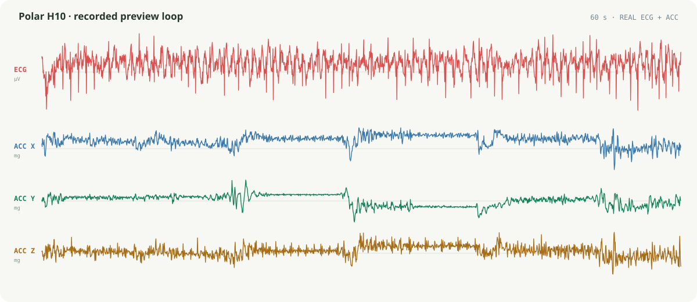
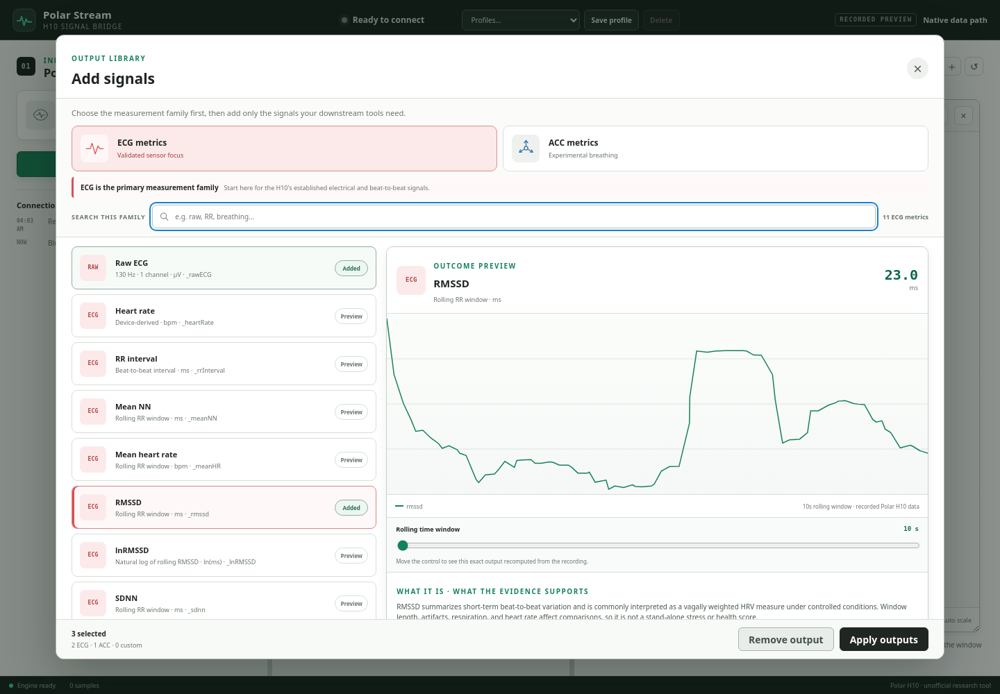
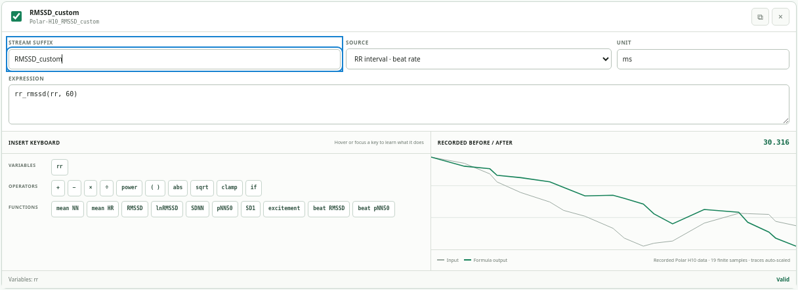

# Polar Stream Recorded Preview

Polar Stream's hardware-free preview loops one anonymized 60-second recording
captured from a real Polar H10. It contains 7,800 ECG samples at 130 Hz, 12,000
three-axis accelerometer samples at 200 Hz, and the HR/RR events received during
the same interval.



## Preview an output before adding it

Open **Add output** and select a metric row. The right-hand outcome panel is
computed from this same recorded ECG/ACC fixture and shows the exact stream
name, current example value, a concise evidence summary, and links to the most
relevant literature or technical documentation. Adding is explicit—there are no
checkboxes—and the chosen outputs remain visible in the dialog footer.



RR-derived metrics expose independent 10–300 second rolling windows. The ACC
breathing previews react immediately to axes, smoothing, sensitivity,
normalization, and inversion settings. Longer RR windows use the available
60-second fixture as a clearly labeled warm-up preview rather than inventing
additional data.

The ECG catalog covers raw ECG, heart rate, RR interval, mean NN, mean heart
rate, RMSSD, lnRMSSD, SDNN, pNN50, Poincaré SD1, and an experimental causal
adaptation of the Excite-O-Meter excitement level. ACC options cover raw X/Y/Z,
3D magnitude, and the two experimental breathing outputs.

## Build a custom formula without memorizing its syntax

Custom formulas use the fixture too: load a scalar built-in metric or use the
source-aware insert keyboard, then compare the recorded input and formula output
in the draft card before applying it. Every key explains its operation on hover
or keyboard focus, and the variable map distinguishes ECG amplitude (`ecg`),
ACC axes (`x y z`), device heart rate (`hr`), and accepted beat interval (`rr`).



Time is always the automatic chart x-axis; the expression computes one output
y-value per source sample or event. HRV metrics therefore operate on the rolling
history of `rr`, not by averaging raw ECG amplitude. The RR keyboard includes
exact duration-based equivalents for Mean NN, Mean HR, RMSSD, lnRMSSD, SDNN,
pNN50, SD1, and the rolling Excite-O-Meter adaptation. The preview parser is
deliberately restricted and cannot execute arbitrary JavaScript; native Rust
validation remains authoritative for published output.

## Try the interface without a strap

Serve the frontend from the repository root:

```bash
npx browser-sync start --server apps/polar-stream/ui --no-open --no-ui
```

Open `http://127.0.0.1:3000` and choose **Mock Data**. The recording then loops
through the normal browser-preview ingestion path, feeding the raw readings,
charts, derived ACC views, and inline ECG sparkline. The native Tauri app keeps
its normal live Polar H10 scan and never enters recorded-preview mode.

## Replace the canonical recording

Wear a moistened, awake strap and run:

```bash
cargo run -p capture-preview-fixture
```

The capture tool writes both shared preview sources:

- `apps/polar-stream/ui/data/preview-recording.json` for looped playback;
- `docs/assets/polar-stream-recorded-preview.svg` for static documentation.

The fixture schema rejects generated, truncated, malformed, or incorrectly
sampled data instead of filling gaps with a simulation. Capture output excludes
the sensor's BLE address and serial number.

## Verify a change

```bash
npm run preview:fixture:test
npm run polar-stream:ui:test
npm run pages:build
```

See the [Polar Stream README](https://github.com/MesmerPrism/PolarH10/tree/main/apps/polar-stream)
for the native build and run commands.
