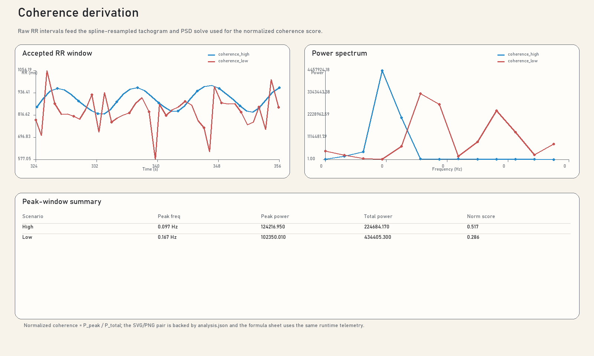
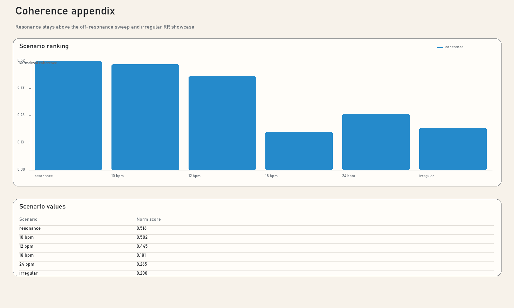

# Coherence Showcase

This page pairs `coherence_high` and `coherence_low` so the published figure
set can show how accepted RR intervals produce a narrowband spectral peak and,
in turn, higher coherence telemetry. The computation framing follows the
McCraty et al. coherence method documented in the
[coherence formula sheet](../coherence-formulas.md), while also separating the
paper-defined ratio from the app-facing `0..1` values exposed in `PolarH10`.

<p>
  <a class="button primary" href="../coherence-formulas.md">Open formula sheet</a>
  <a class="button" href="../assets/synthetic-showcase/coherence-derivation.svg">Download derivation SVG</a>
  <a class="button" href="../assets/synthetic-showcase/coherence-appendix.svg">Download appendix SVG</a>
</p>



<aside class="caption-card" aria-labelledby="coherence-caption-title">
  <div class="caption-card-title" id="coherence-caption-title">Suggested Caption</div>
  <p>Accepted RR intervals from deterministic high- and low-coherence synthetic scenarios are converted to a resampled tachogram and power spectral density. Following the McCraty et al. spectral framing, the dominant peak is searched in <code>0.04-0.26 Hz</code>, integrated in a <code>0.030 Hz</code> window, and compared against total power in <code>0.0033-0.4 Hz</code>. The figure reports both the paper coherence ratio and the app-facing normalized/displayed <code>0..1</code> scores so the publication panel matches the software telemetry while keeping the methodological distinction explicit.</p>
</aside>

## Source Files

- [coherence_high RR window](../data/synthetic-showcase/scenarios/coherence_high/hr_rr.csv)
- [coherence_high analysis](../data/synthetic-showcase/scenarios/coherence_high/analysis.json)
- [coherence_low RR window](../data/synthetic-showcase/scenarios/coherence_low/hr_rr.csv)
- [coherence_low analysis](../data/synthetic-showcase/scenarios/coherence_low/analysis.json)

## Computation Path

```text
AcceptedRrSamples
-> ResampledTachogram
-> PowerSpectrum
-> PeakBandPower / TotalBandPower
-> PaperCoherenceRatio / NormalizedCoherence01 / CurrentCoherence01
```

- `Coherence.Diagnostics.AcceptedRrSamples` exposes the accepted RR window used
  for the solve.
- `Coherence.Diagnostics.ResampledTachogram` exposes the spline-resampled
  tachogram that feeds the PSD step.
- `Coherence.Diagnostics.PowerSpectrum`, `PeakWindowLowerHz`,
  `PeakWindowUpperHz`, `PeakBandPower`, and `TotalBandPower` expose the peak
  search and integral terms.
- `Coherence.Telemetry.PaperCoherenceRatio` is the method-facing ratio described
  in the reference monograph.
- `Coherence.Telemetry.NormalizedCoherence01` is the app's bounded
  `PeakBandPower / TotalBandPower` value.
- `Coherence.Telemetry.CurrentCoherence01` is the displayed coherence value
  surfaced by the app UI and exported here for figure parity with the
  application.

## Interpretation Notes

- The power spectral density is plotted in arbitrary units because the figure is
  meant to expose the computational path and relative separation between
  scenarios, not absolute spectral calibration.
- The figure is deterministic by design. It is an explanatory supplement, not a
  claim that these synthetic traces define normative coherence ranges.

## Appendix Sweep

The appendix figure keeps the resonance and off-resonance comparison visible in
the same publication bundle so authors can show that the strongest coherence
separation occurs near the resonance-like condition while still documenting the
intermediate off-resonance cases.

- [resonance_010hz analysis](../data/synthetic-showcase/scenarios/resonance_010hz/analysis.json)
- [off_10bpm analysis](../data/synthetic-showcase/scenarios/off_10bpm/analysis.json)
- [off_12bpm analysis](../data/synthetic-showcase/scenarios/off_12bpm/analysis.json)
- [off_18bpm analysis](../data/synthetic-showcase/scenarios/off_18bpm/analysis.json)
- [off_24bpm analysis](../data/synthetic-showcase/scenarios/off_24bpm/analysis.json)
- [irregular_rr analysis](../data/synthetic-showcase/scenarios/irregular_rr/analysis.json)



## Related Pages

- [Synthetic Showcase Overview](index.md)
- [Coherence Formula Sheet](../coherence-formulas.md)
- [Coherence Workflow](../coherence-workflow.md)
- [References](../references.md)
- [Formula Sheets](../formula-sheets.md)
