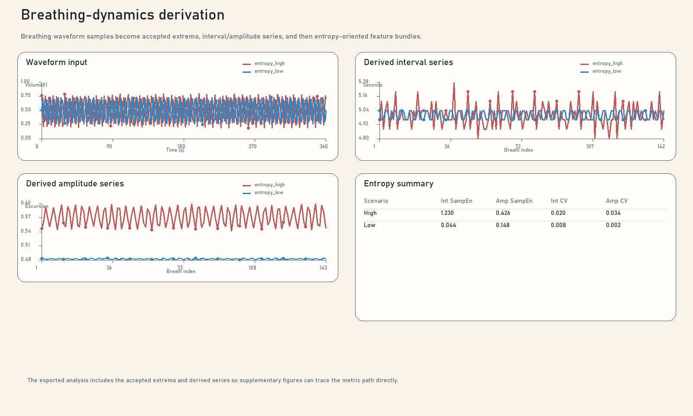
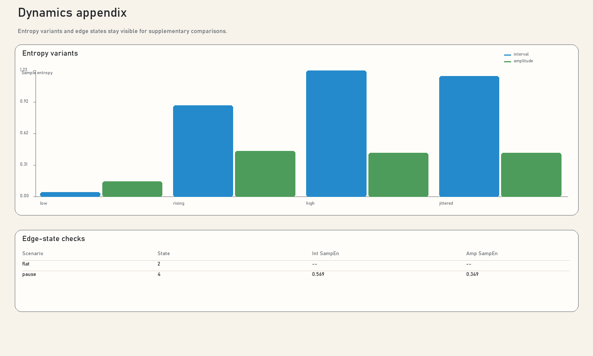

# Breathing Dynamics Showcase

This page uses `entropy_high` and `entropy_low` as the canonical pair for
showing how the breathing waveform becomes accepted extrema, derived interval
and amplitude series, and then the published entropy-oriented telemetry. The
feature family follows the breathing-dynamics framing described by
[Goheen et al. (2025)](https://doi.org/10.1111/psyp.70149), while remaining
explicit that this repository applies those features to the repo's calibrated
ACC-derived breathing waveform rather than to a respiration belt signal.

<p>
  <a class="button primary" href="../breathing-dynamics-formulas.md">Open formula sheet</a>
  <a class="button" href="../assets/synthetic-showcase/dynamics-derivation.svg">Download derivation SVG</a>
  <a class="button" href="../assets/synthetic-showcase/dynamics-appendix.svg">Download appendix SVG</a>
  <a class="button" href="../assets/synthetic-showcase/synthetic-showcase-figure-pack.pdf">Download figure pack PDF</a>
</p>



<aside class="caption-card" aria-labelledby="dynamics-caption-title">
  <div class="caption-card-title" id="dynamics-caption-title">Suggested Caption</div>
  <p>A deterministic high- versus low-entropy breathing pair is shown from the normalized breathing waveform through accepted extrema, derived breath-interval and breath-amplitude series, and the downstream sample-entropy summary used by the app. The feature family follows Goheen et al. (2025), but the present implementation applies it to the calibrated ACC-derived breathing waveform available in <code>PolarH10</code>. Sample entropy is shown with the repository defaults <code>m = 2</code>, <code>delay = 1</code>, and <code>r = 0.2 * SD</code>, so the figure can be reproduced directly from <code>analysis.json</code>.</p>
</aside>

## Source Files

- [entropy_high summary](../data/synthetic-showcase/scenarios/entropy_high/ground_truth.json)
- [entropy_high analysis](../data/synthetic-showcase/scenarios/entropy_high/analysis.json)
- [entropy_low summary](../data/synthetic-showcase/scenarios/entropy_low/ground_truth.json)
- [entropy_low analysis](../data/synthetic-showcase/scenarios/entropy_low/analysis.json)

## Computation Path

```text
WaveformSamples
-> AcceptedExtrema
-> IntervalSeries / AmplitudeSeries
-> Interval.SampleEntropy / Amplitude.SampleEntropy
```

- `Dynamics.Diagnostics.WaveformSamples` exposes the breathing waveform used for
  the dynamics solve.
- `Dynamics.Diagnostics.AcceptedExtrema` exposes the accepted peaks and troughs
  extracted from that waveform.
- `Dynamics.Diagnostics.IntervalSeries` and `AmplitudeSeries` expose the derived
  breath timing and excursion-depth series.
- `Dynamics.Telemetry.Interval.SampleEntropy`,
  `Dynamics.Telemetry.Amplitude.SampleEntropy`, and `TrackingState` expose the
  final downstream values and edge states published by the app.

## Interpretation Notes

- The waveform plotted here is a normalized ACC-derived breathing signal, so the
  amplitude axis is intentionally reported in arbitrary units.
- The feature family is methodologically aligned to the cited breathing-dynamics
  paper, but the signal source is an app-specific adaptation and should be
  described that way in manuscripts.

## Appendix And Edge States

The appendix figure keeps the extra publication cases in the same bundle:

- [entropy_rising analysis](../data/synthetic-showcase/scenarios/entropy_rising/analysis.json)
- [jittered_breathing analysis](../data/synthetic-showcase/scenarios/jittered_breathing/analysis.json)
- [flat_breathing analysis](../data/synthetic-showcase/scenarios/flat_breathing/analysis.json)
- [breathing_pause analysis](../data/synthetic-showcase/scenarios/breathing_pause/analysis.json)

`flat_breathing` keeps entropy unavailable because the excursion never clears
the acceptance thresholds. `breathing_pause` documents the `Stale` end state
after the waveform stops updating near the end of the scenario.



## Related Pages

- [Synthetic Showcase Overview](index.md)
- [Breathing Dynamics Formula Sheet](../breathing-dynamics-formulas.md)
- [Breathing Dynamics Workflow](../breathing-dynamics-workflow.md)
- [References](../references.md)
- [Formula Sheets](../formula-sheets.md)
