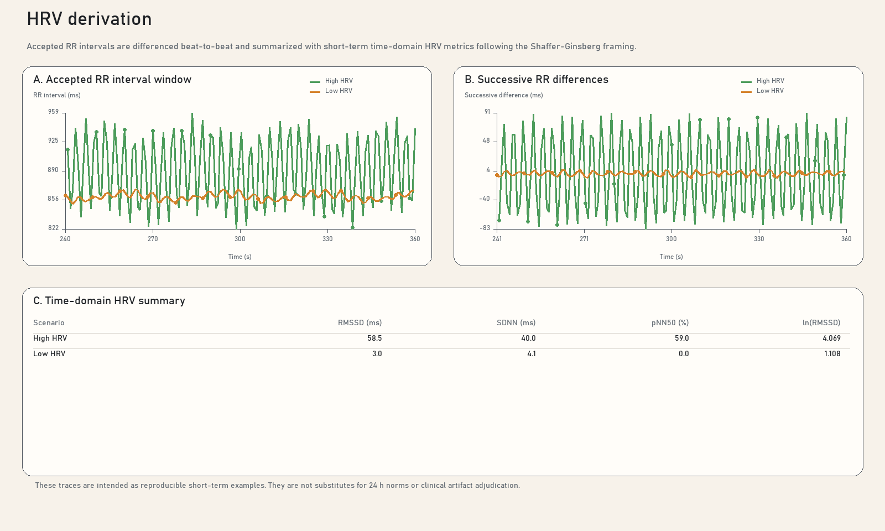

# HRV Showcase

This page uses `hrv_high` and `hrv_low` as the canonical pair for explaining
how accepted RR intervals become successive RR differences and then the
short-term time-domain HRV metrics surfaced by the app. The framing is aligned
to the short-term HRV guidance summarized by
[Shaffer and Ginsberg (2017)](https://doi.org/10.3389/fpubh.2017.00258), while
remaining explicit that this repository publishes short-term RR-derived
telemetry rather than clinical `24 h` norms.

<p>
  <a class="button primary" href="../hrv-formulas.md">Open formula sheet</a>
  <a class="button" href="../assets/synthetic-showcase/hrv-derivation.svg">Download derivation SVG</a>
  <a class="button" href="../assets/synthetic-showcase/synthetic-showcase-figure-pack.pdf">Download figure pack PDF</a>
</p>



## Suggested Caption

*Accepted RR intervals from deterministic high- and low-HRV synthetic scenarios
are converted to successive RR differences and summarized with the standard
short-term time-domain metrics `RMSSD`, `SDNN`, `pNN50`, and `ln(RMSSD)`.
Consistent with the short-term HRV framing reviewed by Shaffer and Ginsberg
(2017), the figure is intended to document how differences in beat-to-beat
variability propagate into the downstream metrics exposed by `PolarH10`, rather
than to provide clinical normative interpretation.*

## Source Files

- [hrv_high RR window](../data/synthetic-showcase/scenarios/hrv_high/hr_rr.csv)
- [hrv_high analysis](../data/synthetic-showcase/scenarios/hrv_high/analysis.json)
- [hrv_low RR window](../data/synthetic-showcase/scenarios/hrv_low/hr_rr.csv)
- [hrv_low analysis](../data/synthetic-showcase/scenarios/hrv_low/analysis.json)

## Computation Path

```text
AcceptedRrSamples
-> AdjacentRrDeltas
-> CurrentRmssdMs / SdnnMs / Pnn50Percent / LnRmssd
```

- `Hrv.Diagnostics.AcceptedRrSamples` exposes the RR window accepted by the
  tracker.
- `Hrv.Diagnostics.AdjacentRrDeltas` exposes the beat-to-beat delta series used
  by `RMSSD` and the related time-domain solves.
- `Hrv.Telemetry.CurrentRmssdMs`, `SdnnMs`, `Pnn50Percent`, and `LnRmssd`
  expose the final documentation values shown in the figure.

## Interpretation Notes

- The tracker uses accepted RR intervals rather than a clinically edited Holter
  NN series, so the figures should be described as short-term RR-derived
  telemetry.
- `ln(RMSSD)` is included because many papers report the log-transformed form to
  reduce skew and improve comparability across sessions.

## Showcase Preset

The `showcase-v1` preset keeps the HRV tracker on a deterministic `120 s`
window with a `32`-sample minimum so the exported figures stay reproducible and
still map cleanly onto the longer-window operator guidance in the main workflow
docs.

## Related Pages

- [Synthetic Showcase Overview](index.md)
- [HRV Formula Sheet](../hrv-formulas.md)
- [HRV Workflow](../hrv-workflow.md)
- [References](../references.md)
- [Formula Sheets](../formula-sheets.md)
