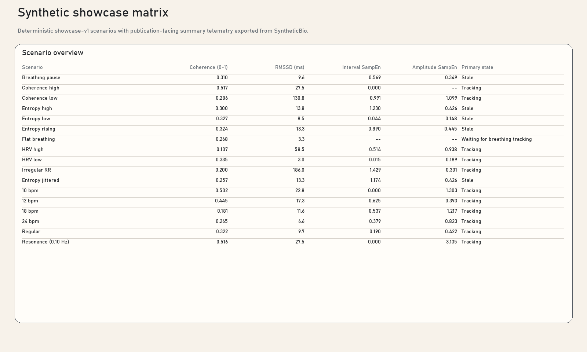

# Synthetic Showcase

`SyntheticBio` is the deterministic source of the showcase bundle published into
this repo. The exported data and rendered figures are committed under
`docs/data/synthetic-showcase` and `docs/assets/synthetic-showcase` so GitHub
Pages can publish them without a sibling checkout or CI-time generation step.
The intent is not just internal documentation. This bundle is written so a
research group can cite the scenario preset, inspect the intermediate traces,
and reuse the rendered figures or source files in supplementary material.

  <a class="button primary" href="../data/synthetic-showcase/showcase-manifest.json">Open manifest</a>
  <a class="button" href="../assets/synthetic-showcase/showcase-overview.svg">Download overview SVG</a>
  <a class="button" href="../assets/synthetic-showcase/synthetic-showcase-figure-pack.pdf">Download figure pack PDF</a>

## Publication Framing

- The bundle is versioned by preset id. The current published release is
  `showcase-v1`.
- Each figure is backed by committed source data so a reviewer can move from
  the published panel to `analysis.json`, `ground_truth.json`, and the raw
  exported traces without rerunning the generator.
- The metric-specific pages below include publication-style framing and
  manuscript-ready caption language for coherence, short-term HRV, and
  breathing dynamics.

## Bundle Contract

- Every scenario folder contains `scenario.json`, `ground_truth.json`,
  `analysis.json`, `hr_rr.csv`, `ecg.csv`, and `session.json`.
- `showcase-manifest.json` records the preset id, duration, generator version,
  tracker settings, scenario inventory, and generated assets.
- `analysis.json` exposes the intermediate traces needed for publication
  figures, while `ground_truth.json` remains the human-readable summary export.

## Computational Path

1. Raw synthetic input is exported as `hr_rr.csv`, `ecg.csv`, and the breathing
   telemetry captured in `ground_truth.json`.
2. Intermediate derivation steps are exported in `analysis.json`, including RR
   windows, spectra, extrema, and derived breath series.
3. Final downstream telemetry is published in `analysis.json` and summarized in
   `ground_truth.json`.

## Live Demo Device Set

- `Polar H10 Demo Coherence High` -> `coherence_high`
- `Polar H10 Demo Coherence Low` -> `coherence_low`
- `Polar H10 Demo HRV High` -> `hrv_high`
- `Polar H10 Demo HRV Low` -> `hrv_low`
- `Polar H10 Demo Entropy High` -> `entropy_high`
- `Polar H10 Demo Entropy Low` -> `entropy_low`

## Metric Pages

- [Coherence showcase](coherence.md)
- [HRV showcase](hrv.md)
- [Breathing dynamics showcase](dynamics.md)

## Appendix Scenarios

- [resonance_010hz analysis](../data/synthetic-showcase/scenarios/resonance_010hz/analysis.json)
- [off_10bpm analysis](../data/synthetic-showcase/scenarios/off_10bpm/analysis.json)
- [off_12bpm analysis](../data/synthetic-showcase/scenarios/off_12bpm/analysis.json)
- [off_18bpm analysis](../data/synthetic-showcase/scenarios/off_18bpm/analysis.json)
- [off_24bpm analysis](../data/synthetic-showcase/scenarios/off_24bpm/analysis.json)
- [irregular_rr analysis](../data/synthetic-showcase/scenarios/irregular_rr/analysis.json)
- [entropy_rising analysis](../data/synthetic-showcase/scenarios/entropy_rising/analysis.json)
- [jittered_breathing analysis](../data/synthetic-showcase/scenarios/jittered_breathing/analysis.json)
- [flat_breathing analysis](../data/synthetic-showcase/scenarios/flat_breathing/analysis.json)
- [breathing_pause analysis](../data/synthetic-showcase/scenarios/breathing_pause/analysis.json)

## Related Pages

- [Formula Sheets](../formula-sheets.md)
- [Coherence Formula Sheet](../coherence-formulas.md)
- [HRV Formula Sheet](../hrv-formulas.md)
- [Breathing Dynamics Formula Sheet](../breathing-dynamics-formulas.md)
