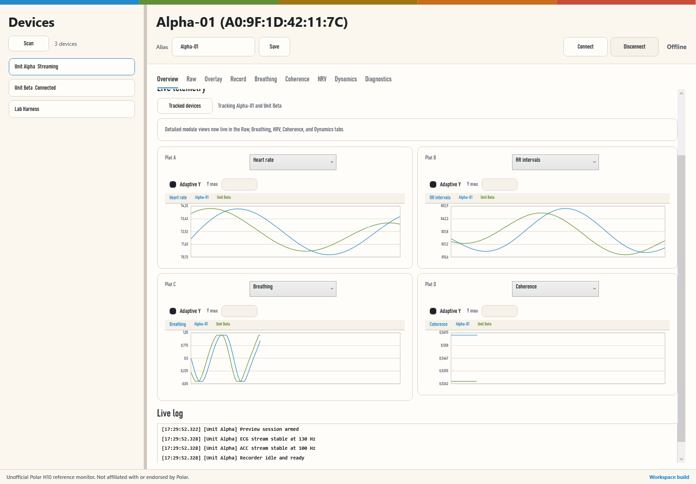

# WPF UI Preview

This page captures the current brutal tDR-inspired redesign pass for the WPF reference app now merged into `main`.

## Applied Direction

- hard black-and-cream shell with warning-yellow and signal-red accents
- condensed industrial typography in place of default WPF UI chrome
- indexed tab strip and denser labeling for a more authored telemetry feel
- dark instrument-style chart windows with sharper trace treatment
- restrained layout that keeps the app usable as a monitoring tool

## Notes

- The screenshot is generated from the current local build of `PolarH10.App`.
- This preview focuses on the main shell, tab system, telemetry panels, and chart language.
- Runtime data states will populate once a device is connected.
